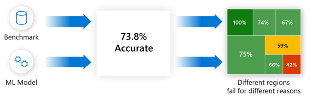

.. _basics_disaggregated:

Basics of Disaggregated Analysis
================================

Responsible AI Tracker for disaggregated model analysis and comparison 
######################################################################

To work toward fair, reliable, and safe model performance, AI practitioners need to be able to compare models and perform rigorous 
evaluation and testing that extend beyond single-score accuracy. Claims like “Model X is 90% accurate” on a given benchmark do not give 
insight as to how reliably a model may perform in the real world. Models can fail for some data cohorts or for certain conditions not reflected in the training data. For instance, a traffic sign detector may not operate well for unexpected inputs, despite the model having high accuracy overall.  

Additionally, an update intended to improve overall model accuracy or performance for certain data cohorts can introduce failures for 
other cohorts. To help avoid this, teams need to continuously track and monitor model behavior to ensure updates are backward compatible 
and maintain user trust.  

Envisioning and testing for what-if scenarios, like “What happens to the accuracy of the recognition model in a self-driving car when 
it is dark and snowing outside?” or “Does the loan approval model perform equally across ally ethnicity, gender, age, and education cohorts?” 
are essential for understanding how models may fail and informing decisions about what mitigations work best.

**Responsible AI Tracker helps you compare models** by showing performance metrics of your choosing for different data cohorts. 
You can do a 1:1 comparison for the same cohort across different models, tracking how different mitigation steps affect the given cohort. 
You can also easily create, manage, and compare cohorts of interest all within Responsible AI Tracker’s interface. 

  Figure - Disaggregated model analysis moves away from aggregate accuracy metrics, exposes the distribution of errors to developers in a 
  transparent way, and enables them to identify & diagnose errors efficiently.

.. figure:: imgs/baseline.png
  :scale: 60%
  :alt: Responsible AI Tracker

  Figure - Even during updates or mitigation actions, it is not guaranteed that the model improves on all examples. In fact, 
  model accuracy may drop for some of the data cohorts leading to backward incompatibility issues. The phenomenon then requires careful model comparison 
  for practitioners to be able to select the best model for deployment in an informed manner.

.. raw:: html

       <iframe width="560" height="315" src="https://www.youtube.com/embed/NYXRrLzGiFk" frameborder="0" allowfullscreen></iframe>

      