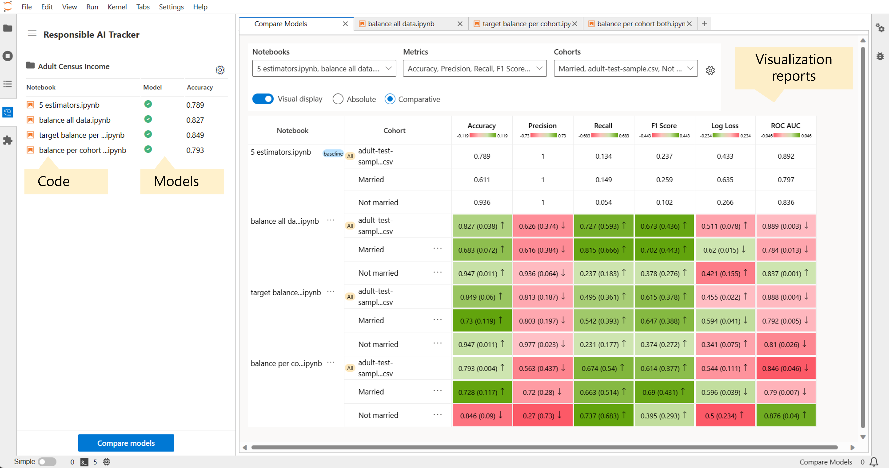

Responsible AI Tracker
=======================

Responsible AI Tracker, a part of the `Responsible AI Toolbox`_, is a JupyterLab extension for managing, tracking, and comparing results of
experiments for improving machine learning (ML) models. The goal of responsible AI is to create trustworthy AI systems that benefit people
while mitigating harms, which can occur when AI systems fail to perform with fair, reliable, or safe outputs for various stakeholders. 
The Responsible AI Tracker is an extension that enables AI practitioners to view models, code, and visualization artifacts all within the same interface, facilitating disaggregated model evaluation and comparison, as well as fast model iteration.

.. _Responsible AI Toolbox: https://responsibleaitoolbox.ai/

  Figure - Responsible AI Tracker brings together several artifacts needed for data science and machine learning practice: code, models, and
  comparative visualizations.

Include a representative screenshot of the extension

You can use Responsible AI Tracker to:
--------------------------------------

* Manage and link model improvement artifacts. Responsible AI Tracker encourages clean and systematic data science practices by allowing you to associate the notebook used to create a model with the resulting model. These practices support careful model tracking and systematic experimentation.

* Perform disaggregated model evaluation and comparison. The model comparison table in the extension provides an in-depth comparison between the different models registered in the extension. This comparison contrasts performance results across different data cohorts and metrics. This disaggregated approach goes beyond single-score performance metrics to help discover data cohorts for which an updated model may now underperform. Learn more about disaggregated evaluation approaches here.

* Explore model improvements with the integrated Responsible AI Mitigations library. As you experiment and ideate different steps for model improvement, the Responsible AI Mitigations library helps you implement different mitigation techniques in Python,  that may improve model performance and can be targeted towards specified cohorts of interests.

* Integrate with mlflow. All models registered in a project in the Responsible AI Tracker is entered into a corresponding project in mlflow. This integration brings the best of both worlds and at the same time allows practitioners to continue their usual MLOps practices via commonly used tools such as mlflow.

.. toctree::
    :maxdepth: 2
    :caption: Overview

    getting_started
    install_guide
    basics_disaggregated
    how
    tour
    rename
    frequently_asked
    known_issues
    get_involved

.. toctree::
   :maxdepth: 2
   :caption: User Guide

   project_management
   notebook_model_management
   cohort_management
   creating_mitigations
   model_comparison
   integration_mlflow
   metric_support

